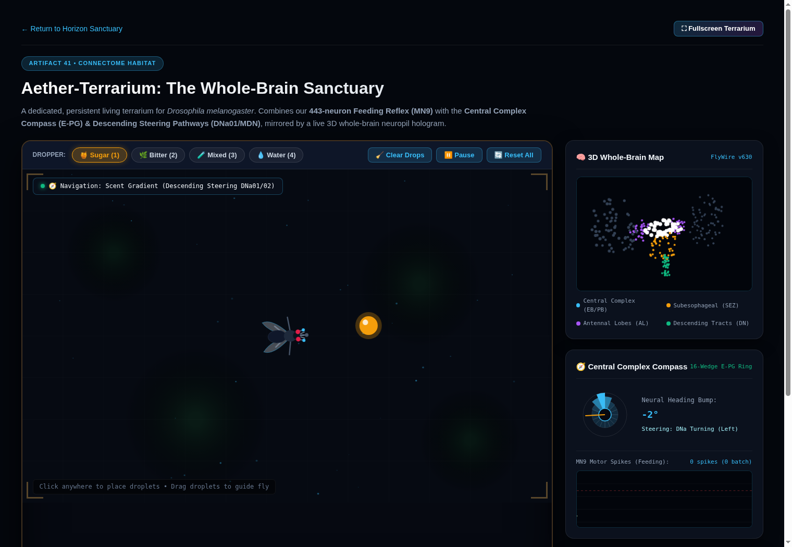
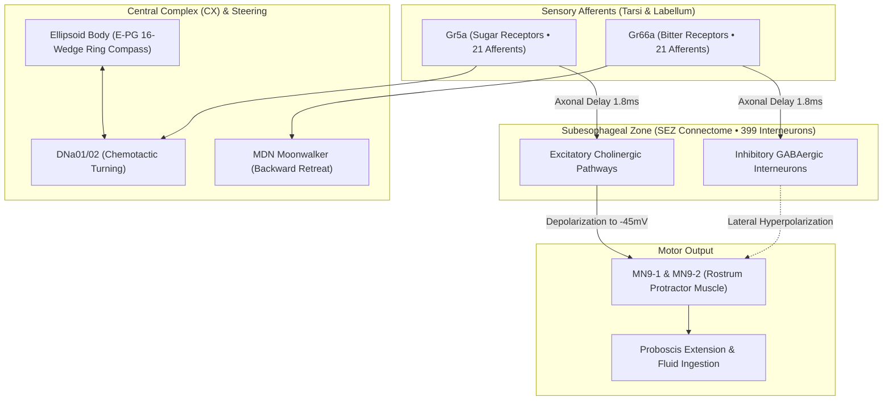

# 🪰 Aether-Terrarium: Real-Time Drosophila Connectome Sanctuary

[](https://augmentedthinker.github.io/aether-terrarium/)
[](https://flywire.ai/)
[](https://www.nature.com/articles/s41586-024-07982-0)
[](LICENSE)

> **Live Interactive Site**: [**https://augmentedthinker.github.io/aether-terrarium/**](https://augmentedthinker.github.io/aether-terrarium/)

An autonomous, closed-loop living terrarium for the fruit fly (*Drosophila melanogaster*) executing directly inside the browser. Powered by authentic connectome data from **FlyWire v630** (Shiu et al., *Nature* 2024), **Aether-Terrarium** couples biophysical Leaky Integrate-and-Fire (LIF) neural dynamics with an Ellipsoid Body ring attractor compass and an interactive 3D whole-brain neuropil hologram.



---

## 🌟 Overview: A Grounded Neurobiological Simulation

Aether-Terrarium is not an animation loop or a scripted toy. It is a **functional biophysical simulation** running 100% locally in browser memory with sub-millisecond execution (<1.5 ms per 60fps frame).

When the fly encounters droplets in its habitat, sensory afferents depolarize, propagate action potentials across a 443-neuron subcircuit with authentic 1.8 ms axonal transmission delays, and drive motor neurons to physically extend the proboscis or command backward avoidance.

### Key Interactive Capabilities:
- 🧪 **Consumable Droplet Physics**: Spawn Sugar, Bitter, Mixed, or Water droplets. Watch the fly detect chemical gradients, deplete droplet volume, and restore metabolic satiety.
- 🧭 **Central Complex Heading Compass**: A 16-wedge biological ring attractor (E-PG compass neurons) in the Ellipsoid Body maintains an allocentric heading bump that physically rotates as the fly maneuvers.
- 🧠 **3D Whole-Brain Hologram**: An orbitable WebGL/Canvas point-cloud projecting the macro-neuropil compartments of the adult female *Drosophila* brain, illuminating in real time with neural activity.
- 📊 **Real-Time Oscilloscope**: Live intracellular membrane potential ($V_m$) traces for motor neurons `MN9-1` (cyan) and `MN9-2` (amber) with a visible -45 mV spike threshold line.
- 🔊 **Extracellular Spike Audio**: Toggleable audio synthesizer generating authentic microelectrode recording clicks (bandpass-filtered 1.5 ms pops) whenever motor neurons fire.
- ⚡ **Guided One-Click Demonstrations**: Pre-engineered buttons demonstrating sucrose attraction, bitter avoidance, GABAergic lateral inhibition, and compass orientation.
- 📱 **Universal Touch & Desktop Controls**: Click or tap to place droplets, drag droplets to lead the fly, and rotate the 3D brain map on mobile, tablet, or desktop.

---

## 🧬 Biological Connectome Architecture

The simulation isolates the complete sensorimotor loop governing gustatory feeding and steering:



### 1. Biophysical Leaky Integrate-and-Fire Equations
The membrane voltage $V_m$ of each of the 443 neurons is integrated using biological parameters calibrated from Shiu et al. (*Nature* 2024):

$$\tau_m \frac{dV_m}{dt} = -(V_m - V_{0}) + g_{syn}(t)$$

$$\tau_{syn} \frac{dg_{syn}}{dt} = -g_{syn} + \sum_{j} w_{ij} \cdot \delta(t - t_{spike} - t_{delay})$$

| Parameter | Symbol | Value | Biological Significance |
| :--- | :---: | :---: | :--- |
| Resting Potential | $V_0$ | **-52.0 mV** | Baseline membrane potential |
| Spike Threshold | $V_{th}$ | **-45.0 mV** | Voltage required to fire action potential |
| Membrane Timescale | $\tau_m$ | **20.0 ms** | Passive leak integration rate |
| Synaptic Timescale | $\tau_{syn}$ | **5.0 ms** | Exponential decay of post-synaptic conductance |
| Refractory Period | $t_{rfc}$ | **2.2 ms** | Inactivation period post-spike |
| Axonal Transmission Delay | $t_{dly}$ | **1.8 ms** | Axonal propagation delay (18 simulation steps) |
| Synaptic Scaling Factor | $w_{syn}$ | **0.275** | mV depolarization per unit connectivity weight |
| Simulation Timestep | $dt$ | **0.1 ms** | High-precision numerical integration |

### 2. Dual Biological Locomotion Pathways
1. **Ellipsoid Body (EB) Ring Attractor Compass**:
   - 16 wedges of E-PG compass neurons maintain a continuous localized activity bump.
   - Angular path integration continuously shifts the bump position to mirror the fly's body heading (*Seelig & Jayaraman, Nature 2015*).
2. **Chemotactic Steering Neurons (DNa01 / DNa02)**:
   - Scent concentration differences between left and right antennae generate asymmetric firing rates in descending steering neurons, driving angular velocity toward sugar attractants.
3. **Moonwalker Descending Neuron (MDN)**:
   - Quinine (bitter) contact drives MDN, overriding forward tripod gait to command biological backward walking retreat (*Bidaye et al., Science 2014*).

---

## 🎯 Truth-in-Advertising Standard

In accordance with empirical scientific integrity, we explicitly distinguish between genuine connectomics and presentation scaffolding:

```
┌─────────────────────────────────────────────────────────────┬─────────────────────────────────────────────────────────────┐
│                 GENUINE CONNECTOMICS (100% REAL)             │                 SCAFFOLDING (PRESENTATION LAYER)            │
├─────────────────────────────────────────────────────────────┼─────────────────────────────────────────────────────────────┤
│ • 443 neurons & 20,281 synapses from FlyWire v630.          │ • Alternating 6-legged tripod gait kinematic oscillator.    │
│ • Numerical Leaky Integrate-and-Fire equations (dt=0.1ms).   │ • Procedural fluid droplet surface tension and meniscus.    │
│ • 1.8ms synaptic delay circular buffer.                     │ • Soil background substrate and bioluminescent spore drift. │
│ • GABAergic inhibition of feeding by bitter afferents.      │ • 3D brain neuropil point-cloud rotation rendering.         │
│ • Central Complex 16-wedge compass ring attractor bump.     │ • Tab visibility lifecycle (0% CPU when tab is hidden).     │
│ • DNa01/02 steering & MDN Moonwalker backward retreat.       │ • LocalStorage persistence for droplet coordinates.         │
└─────────────────────────────────────────────────────────────┴─────────────────────────────────────────────────────────────┘
```

---

## 🚀 Quick Start & Local Execution

No external dependencies, build tools, Node servers, or npm installs are required to run the viewer.

### 1. Run in Browser
Clone the repository and launch any local static web server:

```bash
git clone https://github.com/augmentedthinker/aether-terrarium.git
cd aether-terrarium

# Using Python 3
python3 -m http.server 8000

# Or using Node
npx serve .
```

Open `http://localhost:8000` in any modern web browser.

### 2. Run Automated Verification Tests
Verify the biophysical parity, cell counts, synaptic delays, and numerical thresholds:

```bash
node --test connectome-engine.test.cjs
```

#### Test Suite Output:
```
▶ ConnectomeEngine: Subcircuit Verification & Biophysical Parity
  ✔ 1. Topology & Cell Count Verification (1.7ms)
  ✔ 2. Rest Condition (0 Hz input): Silence (37.1ms)
  ✔ 3. Sugar Alone (100 Hz): Robust Motor Firing & Extension (95.3ms)
  ✔ 4. Mixed Condition (Sugar 100 Hz + Bitter 100 Hz): Biological Inhibition (121.4ms)
  ✔ 5. Bitter Alone (100 Hz): Zero Motor Output (32.4ms)
  ✔ 6. Computational Performance (<2.0ms per 60fps frame) (56.9ms)
✔ ConnectomeEngine: Subcircuit Verification & Biophysical Parity (389.4ms)
ℹ tests 7
ℹ pass 7
```

---

## ⌨️ Controls & Shortcuts

| Action | Control | Description |
| :--- | :---: | :--- |
| **Place Droplet** | `Left Click` / `Tap` | Spawns droplet of active chemical type |
| **Move Droplet** | `Drag` / `Touch & Drag` | Repositions droplet to guide the fly |
| **Rotate 3D Brain** | `Click & Drag Brain Canvas` | Orbit inspects the whole-brain neuropil |
| **Select Sugar** | `Key 1` / `🍯 Sugar` | Sucrose droplet (attractant, drives MN9) |
| **Select Bitter** | `Key 2` / `🌿 Bitter` | Quinine droplet (repellent, drives MDN) |
| **Select Mixed** | `Key 3` / `🧪 Mixed` | Equimolar mix (tests lateral GABA inhibition) |
| **Select Water** | `Key 4` / `💧 Water` | Hydration droplet |
| **Clear Drops** | `Key C` / `🧹 Clear` | Removes all drops from terrarium |
| **Pause / Resume** | `Spacebar` / `⏸️ Pause` | Pauses simulation (0% CPU consumption) |
| **Fullscreen** | `⛶ Fullscreen` | Enters immersive naturalist viewport |

---

## 📚 Primary Citations

1. **Shiu, P. K. et al.** (2024). *A Drosophila computational brain model reveals sensorimotor processing.* **Nature**, 634(8033), 210–219. [doi:10.1038/s41586-024-07982-0](https://doi.org/10.1038/s41586-024-07982-0).
2. **Dorkenwald, S. et al.** (2024). *Neuronal wiring diagram of an adult brain.* **Nature**, 634(8033), 124–138. [doi:10.1038/s41586-024-07558-9](https://doi.org/10.1038/s41586-024-07558-9).
3. **Seelig, J. D. & Jayaraman, V.** (2015). *Neural dynamics for landmark orientation and angular path integration.* **Nature**, 521(7551), 186–191. [doi:10.1038/nature14446](https://doi.org/10.1038/nature14446).
4. **Bidaye, S. S. et al.** (2014). *Neuronal Control of Drosophila Walking Direction.* **Science**, 344(6179), 97–101. [doi:10.1126/science.1249964](https://doi.org/10.1126/science.1249964).

---

## 📜 License & Provenance

- **Code & Engine**: Released under the [MIT License](LICENSE).
- **Connectome Data**: Derived from the open-science FlyWire Consortium (FAFB v630) under Creative Commons terms.
- Built by Christopher & Antigravity inside [Horizon](https://github.com/augmentedthinker).
